# Procesverslag
Markdown is een simpele manier om HTML te schrijven.  
Markdown cheat cheet: [Hulp bij het schrijven van Markdown](https://github.com/adam-p/markdown-here/wiki/Markdown-Cheatsheet).

Nb. De standaardstructuur en de spartaanse opmaak van de README.md zijn helemaal prima. Het gaat om de inhoud van je procesverslag. Besteedt de tijd voor pracht en praal aan je website.

Nb. Door *open* toe te voegen aan een *details* element kun je deze standaard open zetten. Fijn om dat steeds voor de relevante stuk(ken) te doen.

## Jij

uitwerken voor kick-off werkgroep

### Auteur:
Larissa Hartsteen

#### Je startniveau:
Blauw

#### Je focus:
Surface Plane
 

## Je website

uitwerken voor kick-off werkgroep

### Je opdracht:
https://abbotkinneys.com/nl/

#### Screenshot(s) van de eerste pagina (small screen): 
Home pagina  
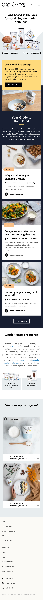

#### Screenshot(s) van de tweede pagina (small screen):
Product pagina   
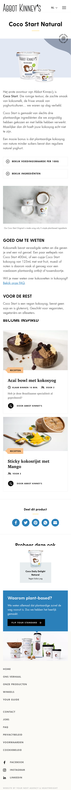
 

## Breakdownschets (week 1)

uitwerken na afloop 2e werkgroep

### de hele pagina: 
<!--  -->
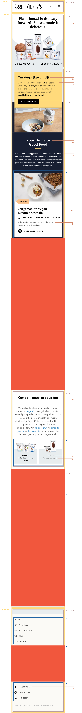
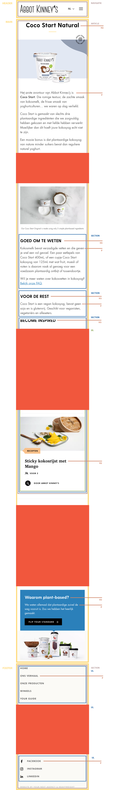

### dynamisch deel: 
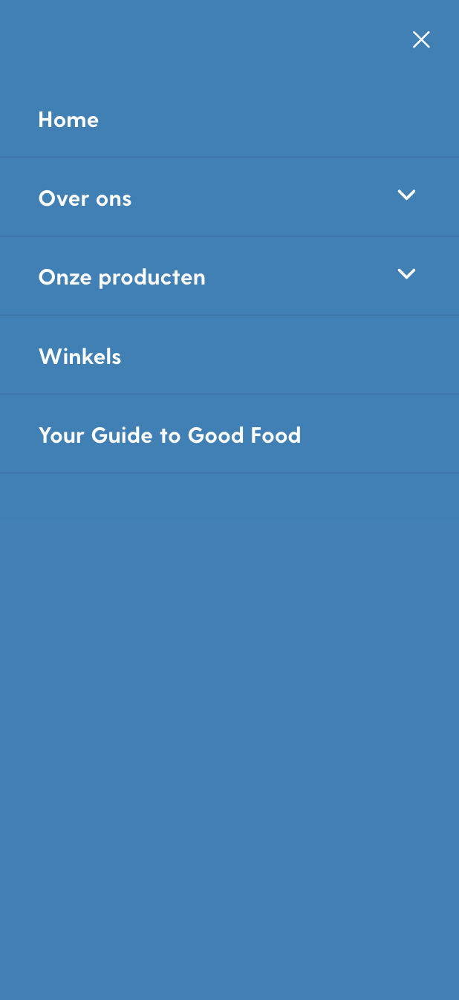

## Voortgang 1 (week 2)

uitwerken voor 1e voortgang

### Stand van zaken
- De 'Bekijk meer' knop krijg ik niet gecentreerd
- De afbeelding krijg ik niet naar de volledige breedte

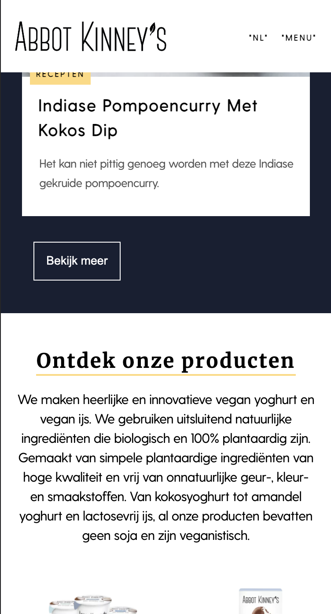
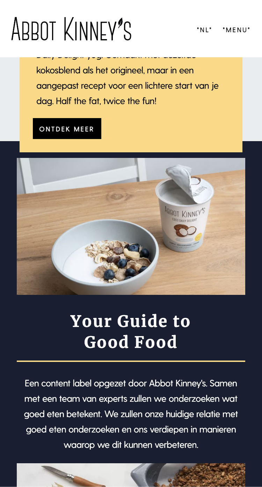

### Agenda voor meeting
samen met je groepje opstellen

| student 1      | student 2          | student 3    | student 4        |
| ---            | ---                | ---          | ---              |
| dit bespreken  | en dit             | en ik dit    | en dan ik dat    |
| en dat ook nog | dit als er tijd is | nog een punt | dit wil ik zeker |
| ...            | ...                | ...          | ...              |

### Verslag van meeting
- Het is nu gelukt om de 'Bekijk meer' knop te centreren
- Als tip gekregen dat je de button tag alleen kan gebruiken voor een actie op de pagina, anders een link.

## Voortgang 2 (week 3)

uitwerken voor 2e voortgang

### Stand van zaken
Dit ging goed:
- 2e pagina bijna klaar
- Animatie's toegevoegd aan website
- Begin gemaakt aan de dark-mode
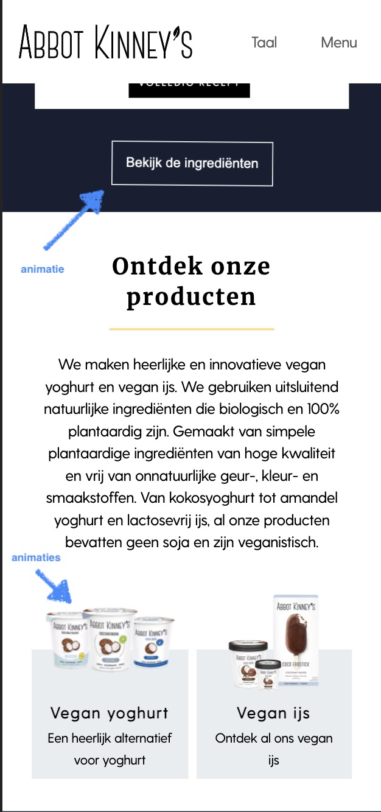

Dit was lastig:
- Het lukt niet om het logo op de 2e pagina kleiner te maken
- Ik wil een ander logo voor de dark-mode, dit is nog niet gelukt
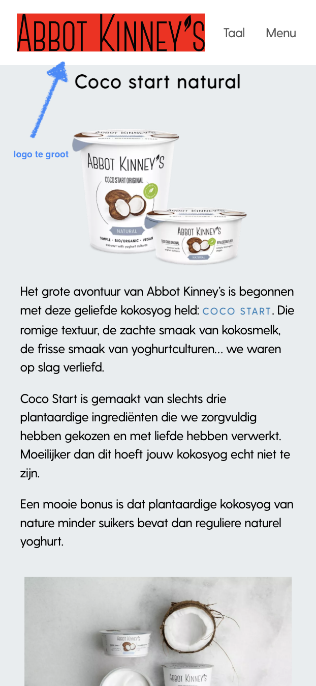
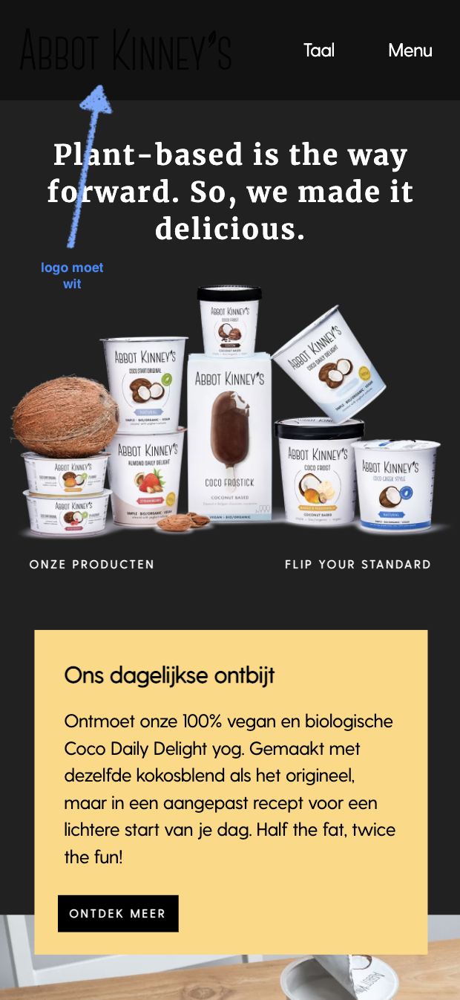

### Agenda voor meeting
samen met je groepje opstellen
| Anneke            |Yeliz              | Larissa           | Linsey            |
| ---               | ---               | ---               | ---               |
| Niets vragen maar | Vragen welke 2e   | Hoe verander je   | ?                 |
| misschien tijdens | pagina beter is   | het logo voor de  |                   |
| call wel          | om te maken       | dark-mode?        |                   |

### Verslag van meeting
hier na afloop snel de uitkomsten van de meeting vastleggen

- Het is is nu gelukt om het logo wit te krijgen in plaats van de afbeelding de hoeven veranderen
- In de les kijken hoe deze kleiner gemaakt kan worden

## Toegankelijkheidstest (week 4)

uitwerken na test in 8e voortgang

### Bevindingen
Lijst met je bevindingen die in de test naar voren kwamen:
- Kleine knopjes zijn niet toegankelijk
- Hoge contrasten zijn nodig voor mensen met kleurenblindheid
- Een kleine font-size is niet toegankelijk genoeg

#### Kleine knopjes zijn niet toegankelijk
Met het spasme/parkinson apparaat was het op de eerste stand goed te doen om op de knoppen te klikken, op de linkjes in de tekst ging dit lastiger. Op de hogere standen was het lastig om op deze te klikken. 

Dit kan opgelost worden door de knoppen en linkjes wat groter te maken. Door padding toe te voegen wordt de ruimte om te klikken groter. 

#### Hoge contrasten zijn nodig voor mensen met kleurenblindheid 
Met de 'color #0779P' bril was alles goed te zien en het contrast tussen de kleuren was prima. Met de 'low contrast' bril was het lastig om het zwart op een gele achtergrond te zien, dit was vooral bij de icoontjes onder de ingrediënten lijst (in dark-mode).

Dit kan opgelost worden door de website door een contrast checker te halen en de moeilijk zichtbare onderdelen van kleur te veranderen.

#### Een kleine font-size is niet toegankelijk genoeg
Ik heb met de 'peripheral field loss #0775p' bril getest. De testperoon kon de tekst met deze bril duidelijk lezen. Ook heb ik ook met de 'central field loss AMD #200774' bril getest. Hiermee was het moeilijker om de tekst te lezen, dit was lastig om te testen, omdat je er nu zelf omheen kan kijken. Verder heb ik de 'combined loss diabetic eye disease #200773' bril gebruikt. Hiermee kon de testpersoon de tekst goed lezen en was hier niets op aan te merken.

Dit kan opgelost worden door een functie aan de webite toe te voegen waarmee de gebruiker de grootte van de tekst kan wijzigen.

#### 
Hier korte omschrijving (met indien nodig een afbeelding)

Hier een omschrijving van hoe het opgelost kan worden (met indien nodig een afbeelding)

## Voortgang 3 (week 4)

uitwerken voor 3e voortgang

### Stand van zaken
Dit ging goed:
- Dark-mode is af en is nu efficienter aangesproken in de @media
- Het is gelukt om het logo op de 2e pagina kleiner te maken en veranderd nu mee in kleur met de dark-mode

Dit was lastig:
- De footer is versprongen op de 2e pagina
- Ik moet de surface plane nog wat verder uitwerken
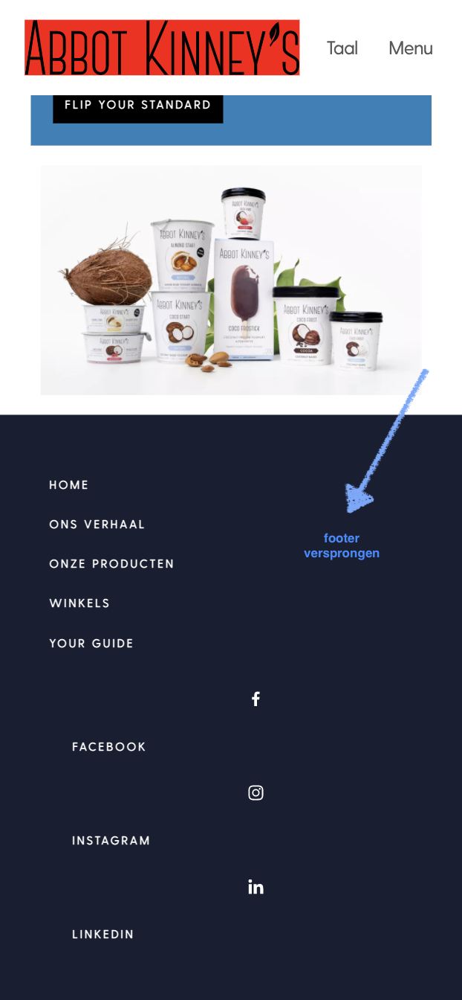

### Agenda voor meeting
samen met je groepje opstellen

| Anneke            |Yeliz              | Larissa           | Linsey            |
| ---               | ---               | ---               | ---               |
| Wil vragen of er  | Vragen of het     | Heeft probleem    | Wil ook tips      |
| handige tips zijn | hamburgermenu     | dat de footer is  | krijgen over hoe  |
| om je css netter  | onder de DOM      | versprongen op de | je je css netter  |
| te maken          | manipulatie valt  | tweede pagina     | kan maken         |

### Verslag van meeting
hier na afloop snel de uitkomsten van de meeting vastleggen

- Het probleem van mijn footer die versprongen was is opgelost
- Wij hebben een aantal tips gekregen over hoe wij onze css netter kunnen maken 

## Eindgesprek (week 5)

uitwerken voor eindgesprek

### Stand van zaken
hier dit ging goed & dit was lastig (neem ook screenshots op van delen van je website en code)

### Screenshot(s)

hier screenshot(s) van je eindresultaat

## Bronnenlijst

continu bijhouden terwijl je werkt

### Code bronnen
1. https://codepen.io/shooft/pen/zYzEPgv -menu
2. https://codepen.io/shooft/pen/GREjemg -section 8-
3. https://www.w3schools.com/html/html5_video.asp -video-

### Images & video bronnen
1. https://www.facebook.com/abbotkinneys/videos/oh-oh-deze-ijsjes-zijn-zo-lekker-wij-kunnen-echt-niet-kiezen-welke-smaak-eet-jij/1452197294859217/
2. https://abbotkinneys.com
3. https://abbotkinneys.com/guide/homemade-vegan-banana-granola
4. https://abbotkinneys.com/guide/pumpkin-kale-salad-with-mustard-yog-dressing
5. https://abbotkinneys.com/guide/indian-spiced-pumpkin-curry-with-coconut-dip
6. https://abbotkinneys.com/vegan-yog/coco-start-natural
7. https://abbotkinneys.com/guide/acaï-bowl-with-coconut-yog
8. https://abbotkinneys.com/guide/mango-sticky-coconut-rice

