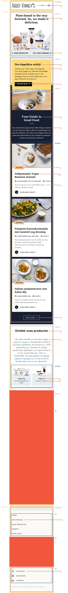

# Procesverslag
Markdown is een simpele manier om HTML te schrijven.  
Markdown cheat cheet: [Hulp bij het schrijven van Markdown](https://github.com/adam-p/markdown-here/wiki/Markdown-Cheatsheet).

Nb. De standaardstructuur en de spartaanse opmaak van de README.md zijn helemaal prima. Het gaat om de inhoud van je procesverslag. Besteedt de tijd voor pracht en praal aan je website.

Nb. Door *open* toe te voegen aan een *details* element kun je deze standaard open zetten. Fijn om dat steeds voor de relevante stuk(ken) te doen.

## Jij

uitwerken voor kick-off werkgroep

### Auteur:
Larissa Hartsteen

#### Je startniveau:
Blauw

#### Je focus:
Surface Plane
 

## Je website

uitwerken voor kick-off werkgroep

### Je opdracht:
https://abbotkinneys.com/nl/

#### Screenshot(s) van de eerste pagina (small screen): 
Home pagina  

#### Screenshot(s) van de tweede pagina (small screen):
Product pagina   

 

## Breakdownschets (week 1)

uitwerken na afloop 2e werkgroep

### de hele pagina: 
<!--  -->

### dynamisch deel (bijv menu): 
<!--  -->

### wellicht nog een dynamisch deel (bijv filter): 
<!--  -->

## Voortgang 1 (week 2)

uitwerken voor 1e voortgang

### Stand van zaken
- De 'Bekijk meer' knop krijg ik niet gecentreerd
- De afbeelding krijg ik niet naar de volledige breedte

### Agenda voor meeting
samen met je groepje opstellen

| student 1      | student 2          | student 3    | student 4        |
| ---            | ---                | ---          | ---              |
| dit bespreken  | en dit             | en ik dit    | en dan ik dat    |
| en dat ook nog | dit als er tijd is | nog een punt | dit wil ik zeker |
| ...            | ...                | ...          | ...              |

### Verslag van meeting
- Het is nu gelukt om de 'Bekijk meer' knop te centreren
- Als tip gekregen dat je de button tag alleen kan gebruiken voor een actie op de pagina, anders een link.

## Voortgang 2 (week 3)

uitwerken voor 2e voortgang

### Stand van zaken
Dit ging goed:
- 2e pagina bijna klaar
- Animatie's toegevoegd aan website
- Begin gemaakt aan de dark-mode

Dit was lastig:
- Het lukt niet om het logo op de 2e pagina kleiner te maken
- Ik wil een ander logo voor de dark-mode, dit is nog niet gelukt
- De footer is versprongen op de 2e pagina

### Agenda voor meeting
samen met je groepje opstellen
| Anneke            |Yeliz              | Larissa           | Linsey            |
| ---               | ---               | ---               | ---               |
| Niets vragen maar | Vragen welke 2e   | Hoe verander je   | ?                 |
| misschien tijdens | pagina beter is   | het logo voor de  |                   |
| call wel          | om te maken       | dark-mode?        |                   |

### Verslag van meeting
hier na afloop snel de uitkomsten van de meeting vastleggen

- Het is is nu gelukt om het logo wit te krijgen in plaats van de afbeelding de hoeven veranderen
- In de les kijken hoe deze kleiner gemaakt kan worden

## Toegankelijkheidstest (week 4)

uitwerken na test in 8e voortgang

### Bevindingen
Lijst met je bevindingen die in de test naar voren kwamen:
- spasme/parkinson
    moulijk touchpad
    eerste stand prima te doen

- color #0779P (geel)
    alles goed te zien, kleuren contast prima 

#### Titel eerste bevinding
Hier korte omschrijving (met indien nodig een afbeelding)

Hier een omschrijving van hoe het opgelost kan worden (met indien nodig een afbeelding)

#### Titel tweede bevinding. 
Hier korte omschrijving (met indien nodig een afbeelding)

Hier een omschrijving van hoe het opgelost kan worden (met indien nodig een afbeelding)

#### Titel volgende bevinding. 
Hier korte omschrijving (met indien nodig een afbeelding)

Hier een omschrijving van hoe het opgelost kan worden (met indien nodig een afbeelding)

#### Titel nog een bevinding. 
Hier korte omschrijving (met indien nodig een afbeelding)

Hier een omschrijving van hoe het opgelost kan worden (met indien nodig een afbeelding)

## Voortgang 3 (week 4)

uitwerken voor 3e voortgang

### Stand van zaken
hier dit ging goed & dit was lastig (neem ook screenshots op van delen van je website en code)

### Agenda voor meeting
samen met je groepje opstellen

| student 1      | student 2          | student 3    | student 4        |
| ---            | ---                | ---          | ---              |
| dit bespreken  | en dit             | en ik dit    | en dan ik dat    |
| en dat ook nog | dit als er tijd is | nog een punt | dit wil ik zeker |
| ...            | ...                | ...          | ...              |

### Verslag van meeting
hier na afloop snel de uitkomsten van de meeting vastleggen

- punt 1
- punt 2
- nog een punt
- ...

## Eindgesprek (week 5)

uitwerken voor eindgesprek

### Stand van zaken
hier dit ging goed & dit was lastig (neem ook screenshots op van delen van je website en code)

### Screenshot(s)

hier screenshot(s) van je eindresultaat

## Bronnenlijst

continu bijhouden terwijl je werkt

Nb. Wees specifiek ('css-tricks' als bron is bijv. niet specifiek genoeg).

1. bron 1
2. bron 2
3. ...

